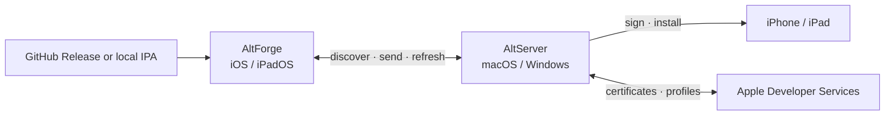

<p align="center">
  
</p>

<p align="center"><strong>AltStore Classic, maintained for Unicode apps, international users, and modern Apple platforms.</strong></p>

<p align="center">
  <strong>English</strong> · <a href="README.zh-CN.md">简体中文</a>
</p>

<p align="center">
  <a href="https://github.com/legeling/AltForge/releases"></a>
  <a href="https://swift.org/"></a>
  
  
  
  <a href="LICENSE"></a>
</p>

<p align="center">
  <a href="https://github.com/legeling/AltForge/releases"><strong>Releases</strong></a> ·
  <a href="https://altforge-dz7.pages.dev"><strong>Website</strong></a> ·
  <a href="#what-altforge-changes"><strong>Changes</strong></a> ·
  <a href="#build-from-source"><strong>Build</strong></a> ·
  <a href="docs/README.md"><strong>Documentation</strong></a> ·
  <a href="https://github.com/legeling/AltForge/issues"><strong>Issues</strong></a>
</p>

AltForge is an independent derivative of [AltStore](https://github.com/altstoreio/AltStore). It preserves the proven AltStore/AltServer architecture while maintaining compatibility fixes and practical improvements for the Classic sideloading workflow.

The official download and installation page is [altforge-dz7.pages.dev](https://altforge-dz7.pages.dev). Its macOS, Windows, and IPA downloads always resolve to this repository's latest published GitHub Release.

> [!IMPORTANT]
> AltForge is built as an **AltStore Classic** application. The `marketplace` branch name is historical; releases do not embed the Marketplace extension or entitlement.

## At A Glance

<table>
  <tr>
    <td width="50%"><strong>Unicode without renaming</strong><br>Install IPA files with Chinese and other Unicode display names or resource paths while keeping the original on-device name.</td>
    <td width="50%"><strong>English + 简体中文</strong><br>Use English or Simplified Chinese through iOS per-app language selection and the AltForge Server status-menu settings.</td>
  </tr>
  <tr>
    <td width="50%"><strong>Classic-first maintenance</strong><br>Keep the familiar Apple ID and AltServer workflow without silently changing the distribution model.</td>
    <td width="50%"><strong>Traceable engineering</strong><br>Track requirements, architecture, verification, known issues, and changes directly in the repository.</td>
  </tr>
</table>

## What AltForge Changes

| Area | AltForge behavior |
|---|---|
| **Identity and source** | Uses the AltForge brand, `com.legeling.AltForge` identifier family, and this repository's GitHub Release source. |
| **Unicode IPA support** | Reads UTF-8 and Info-ZIP Unicode Path metadata, includes bounded fallbacks for common legacy East Asian filename encodings, and writes UTF-8 ZIP paths. |
| **Apple App ID compatibility** | Converts only the Apple App ID description to safe ASCII without changing the app's Unicode display name. |
| **Developer teams** | Supports individual, organization, and free developer-team fallback in both client and AltServer installation paths. |
| **Reliable desktop installs** | Shows transfer size, speed, source, signing, and device-install progress; deduplicates work per device and supports manual switching among SHA-256-verified GitHub, configured CDN, and mirror routes. |
| **Maintenance fixes** | Prevents negative expiration-day displays and makes macOS error details selectable without discarding attributed formatting. |
| **Build and documentation** | Uses one tag-driven workflow for bounded iOS, macOS, and Windows validation, packaging, and release, with a complete spec and change history under [`docs/`](docs/README.md). |

General compatibility fixes remain separate from branding where practical so they can be contributed upstream.

## Get AltForge

<table>
  <tr>
    <td width="50%" valign="top">
      <strong>Install a release</strong><br><br>
      Download AltServer for macOS or Windows, connect and trust the device, then choose <strong>Install AltForge</strong> from the AltServer menu. The macOS server keeps one visible task per device, reports transfer size and speed, and lets users switch verified download routes.<br><br>
      <a href="https://github.com/legeling/AltForge/releases"><strong>Open GitHub Releases →</strong></a>
    </td>
    <td width="50%" valign="top">
      <strong>Build the project</strong><br><br>
      Clone recursively, install the locked CocoaPods dependencies, and open <code>AltStore.xcworkspace</code> with Xcode 26.<br><br>
      <a href="#build-from-source"><strong>Read build instructions →</strong></a>
    </td>
  </tr>
</table>

A tagged release is expected to provide:

| Artifact | Purpose |
|---|---|
| `AltForge.ipa` | Unsigned Classic package that AltServer signs for the selected Apple ID, team, and device. |
| `AltForge-AltServer-macOS.dmg` | Universal macOS AltServer disk image with an Applications shortcut. |
| `AltForge-AltServer-Windows.zip` | Portable Win32 AltServer application and required runtime DLLs. |
| `apps.json` | Official AltForge source metadata. |
| `flags.json` | Classic feature flags owned by this repository; empty by default. |
| `sources.json` | Trusted and blocked source policy owned by this repository. |
| `recommended-sources.json` | Optional recommended source collections; empty by default. |
| `developerdisks.json` | Reviewed Developer Disk URL index used by both desktop servers; referenced disk files remain external. |
| `SHA256SUMS.txt` | SHA-256 checksums for release artifacts. |

Only a matching `vX.Y.Z` tag starts the Release workflow. Hosted macOS and Windows runners build and package all platform artifacts, validate the IPA/DMG structure, product identity, version, Universal architectures and runtime files, verify the final checksum manifest, then create a Draft Release for manual review.

AltForge-owned update and configuration metadata is published only from this repository. Apple services, Patreon, third-party sources, build dependencies, and Developer Disk files retain their real external owners; AltForge publishes only the reviewed disk URL index. Classic builds do not contact the upstream Marketplace or Fediverse control services. Patreon sign-in is disabled unless a builder supplies their own OAuth credentials and HTTPS redirect URI.

The IPA cannot be installed by tapping it on an iPhone or iPad. The macOS app bundle is sealed with an ad-hoc integrity signature so its login item can be registered, but the DMG is not Developer ID signed or notarized; the Windows ZIP is also unsigned. Mount the DMG and drag `AltForge Server.app` to Applications; see the [local macOS validation guide](docs/guides/local-macos-validation.md) for a source build and first-launch procedure. Windows users must install the desktop versions of iTunes and iCloud from Apple's website, not the Microsoft Store. Extract the complete ZIP so every DLL remains beside `AltServer.exe`, and verify the published checksum before installation.

## Requirements

| Component | Minimum |
|---|---|
| AltForge | iOS or iPadOS 17.4 |
| AltServer | macOS 11 or Windows 10 |
| AltJIT | macOS 13 |
| Apple build host | macOS with Xcode 26, CocoaPods, Git, and recursive submodules |
| Windows build host | Windows with Visual Studio 2022 C++, PowerShell, Git, and vcpkg |
| Swift | Swift 5.0 language mode under the Xcode 26 toolchain |

An Apple ID and a compatible Apple developer team are required by Apple's signing flow. On macOS, AltForge Server remembers successfully authenticated accounts and can optionally store their passwords in this Mac's Keychain; passwords are never written to UserDefaults or ordinary logs. AltForge has not been migrated to Swift 6 language mode.

## How It Works



AltForge manages sources, downloads, installed-app state, and user workflows. AltServer performs desktop-side authentication, signing preparation, and device installation. AltSign owns the Apple Developer API, application model, signing, and IPA/ZIP handling.

## Build From Source

```sh
git clone --recurse-submodules https://github.com/legeling/AltForge.git
cd AltForge
git submodule update --init --recursive
pod install --deployment
open AltStore.xcworkspace
```

In Xcode:

1. Select your development team for the AltStore, AltWidgetExtension, and AltBackup targets.
2. When running AltForge directly from Xcode, set `ALTDeviceID` in the AltStore Info.plist to the target device UDID.
3. Optionally set `ALTServerID` to the Bonjour `serverID` advertised by AltServer. AltForge can fall back to another available server when it is omitted.
4. Select the AltStore or AltServer scheme and build the required target.

Repeatable command-line checks live in the [verification guide](docs/workflow/04-verification/README.md). Signing, provisioning, installation, and JIT changes still require a sanitized real-device validation plan.

The Windows toolchain and repeatable PowerShell build are documented in [`AltServer-Windows/README.md`](AltServer-Windows/README.md).

<details>
<summary><strong>Release maintainer workflow</strong></summary>

AltForge starts its independent release sequence at `2.4.0`. Upstream AltStore and AltServer versions are recorded only as source provenance and do not control AltForge's version. Only a numeric `vX.Y.Z` tag triggers automated builds and Draft Release creation. The root `VERSION` file is the product-version source of truth for AltForge, macOS AltServer, and Windows AltServer; ordinary pushes and pull requests do not start a GitHub Actions build.

```sh
version="$(tr -d '[:space:]' < VERSION)"
ruby Scripts/check_release_version.rb
ruby Scripts/test_release_metadata.rb
python3 -B Scripts/test_release_privacy.py
ruby Scripts/test_repository_contract.rb
git tag "v${version}"
git push origin "v${version}"
```

The workflow rejects a tag that differs from `VERSION`, then builds an unsigned IPA, a universal macOS AltServer DMG, and a portable Win32 AltServer archive, generates the source/configuration metadata and checksums, and creates a **draft** GitHub Release. CI build numbers use the GitHub run number and remain distinct from the shared product version. A maintainer must download and verify the draft before publishing it; an unpublished draft does not change `releases/latest`.

`Release/app-permissions.json` owns reviewed source permission declarations. Release gates compare privacy usage-description keys in the built IPA's main app and extensions against this policy and generated `apps.json`; they do not automatically grant newly discovered permissions. For downloaded artifacts, run `python3 Scripts/check_release_privacy.py --ipa /path/to/AltForge.ipa --source /path/to/apps.json` in addition to checksum verification.

</details>

## Repository Map

| Path | Responsibility |
|---|---|
| `AltStore/` | iOS user interface and app-management workflow |
| `AltServer/` | macOS authentication, signing preparation, and device installation |
| `AltServer-Windows/` | Windows authentication, signing preparation, device installation, and packaging |
| `AltStoreCore/` | Shared domain models, persistence, sources, and utilities |
| `Shared/` | Client/server protocol and shared application behavior |
| `Dependencies/AltSign/` | Apple Developer API, signing, application models, and IPA/ZIP handling |
| `AltTests/` | XCTest coverage for shared and application behavior |
| `docs/` | Requirements, design, verification, issues, changes, ADRs, releases, and rules |

Historical `AltStore`, `AltServer`, and `ALT*` code identifiers remain where renaming would create unnecessary upstream conflicts. Public product text and official source identity use AltForge.

## Documentation And Contributing

Start with the [documentation index](docs/README.md) and [project rules](AGENTS.md). Commit conventions and quality gates live in [`docs/rules/`](docs/rules/README.md).

| Need | Start here |
|---|---|
| Current roadmap | [Tasks](docs/workflow/05-tasks/README.md) |
| Test status and gaps | [Verification](docs/workflow/04-verification/README.md) |
| Known risks | [Issue register](docs/issues/README.md) |
| Implementation history | [Change records](docs/changes/README.md) |

## Known Limitations

- Windows source and CI are included, but the first hosted build and sanitized Windows device smoke test remain required before treating its release artifact as verified.
- The imported Windows notification-area interface currently remains in English; the English/Simplified Chinese language switch is implemented in the iOS client.
- The macOS app bundle currently uses a deep ad-hoc integrity signature, not a Developer ID identity, and the DMG is not notarized. Public distribution still requires an explicit Gatekeeper warning until a signing/notarization plan is implemented.
- Unicode archive handling has implementation-level validation, but persistent AltSign fixtures and broader real-device coverage are still being expanded.

## Upstream And License

AltForge is derived from [altstoreio/AltStore](https://github.com/altstoreio/AltStore). The upstream repository remains configured as a separate Git remote so compatible fixes can move in either direction. AltSign compatibility work is maintained in the [AltForge AltSign fork](https://github.com/legeling/AltSign) while remaining traceable to [AltSign upstream](https://github.com/rileytestut/AltSign).

AltForge is distributed under the [GNU Affero General Public License v3.0](LICENSE). Third-party dependencies remain under their respective licenses.
