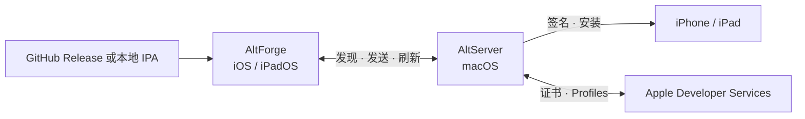

<p align="center">
  <picture>
    <source media="(prefers-color-scheme: dark)" srcset="AltStore/Resources/Icons.xcassets/Raw/AppIcon.imageset/GlassIconDark.png">
    
  </picture>
</p>

<h1 align="center">AltForge</h1>

<p align="center"><strong>为 Unicode 应用、国际用户和现代 Apple 平台持续维护的 AltStore Classic。</strong></p>

<p align="center">
  <a href="README.md">English</a> · <strong>简体中文</strong>
</p>

<p align="center">
  <a href="https://github.com/legeling/AltForge/releases"></a>
  <a href="https://swift.org/"></a>
  
  
  <a href="LICENSE"></a>
</p>

<p align="center">
  <a href="https://github.com/legeling/AltForge/releases"><strong>下载</strong></a> ·
  <a href="#altforge-的主要修改"><strong>改动</strong></a> ·
  <a href="#从源码构建"><strong>构建</strong></a> ·
  <a href="docs/README.md"><strong>文档</strong></a> ·
  <a href="https://github.com/legeling/AltForge/issues"><strong>Issue</strong></a>
</p>

AltForge 是 [AltStore](https://github.com/altstoreio/AltStore) 的独立衍生项目。它保留经过验证的 AltStore/AltServer 架构，同时持续维护 Classic 侧载流程需要的兼容性修复和实用改进。

> [!IMPORTANT]
> AltForge 构建为 **AltStore Classic** 应用。`marketplace` 是历史分支名称；发布版本不会嵌入 Marketplace extension 或 entitlement。

## 项目特点

<table>
  <tr>
    <td width="50%"><strong>保留原名的 Unicode 安装</strong><br>安装显示名或资源路径包含中文及其他 Unicode 字符的 IPA，同时保留设备上的原始名称。</td>
    <td width="50%"><strong>English + 简体中文</strong><br>使用英文或简体中文界面，并支持 iOS 单 App 语言切换。</td>
  </tr>
  <tr>
    <td width="50%"><strong>专注 Classic 维护</strong><br>保留熟悉的 Apple ID 与 AltServer 流程，不在不知情的情况下改变分发模型。</td>
    <td width="50%"><strong>工程过程可追踪</strong><br>把需求、架构、验证、已知问题和变更历史直接维护在仓库中。</td>
  </tr>
</table>

## AltForge 的主要修改

| 范围 | AltForge 行为 |
|---|---|
| **产品标识与 source** | 使用 AltForge 品牌、`com.legeling.AltForge` identifier 系列，以及本仓库 GitHub Release 提供的官方 source。 |
| **Unicode IPA 支持** | 读取 UTF-8 和 Info-ZIP Unicode Path 元数据，为常见东亚旧式文件名编码提供有界 fallback，并以 UTF-8 写出 ZIP 路径。 |
| **Apple App ID 兼容** | 只把 Apple App ID description 转为安全 ASCII，不修改应用的 Unicode 显示名。 |
| **开发团队** | 客户端和 AltServer 安装链路均支持个人、组织和免费开发团队 fallback。 |
| **维护修复** | 防止已过期应用显示负数天数；macOS 错误详情保留富文本格式并支持选择复制。 |
| **构建与文档** | 提供有边界的 CI/release workflow，并在 [`docs/`](docs/README.md) 中维护完整 spec、验证、Issue 和变更历史。 |

通用兼容性修复会尽量与品牌改动分离，以便在合适时回馈给上游项目。

## 获取 AltForge

<table>
  <tr>
    <td width="50%" valign="top">
      <strong>安装发布版本</strong><br><br>
      下载 macOS AltServer，连接并信任设备，然后在 AltServer 菜单中选择 <strong>Install AltForge</strong>。<br><br>
      <a href="https://github.com/legeling/AltForge/releases"><strong>打开 GitHub Releases →</strong></a>
    </td>
    <td width="50%" valign="top">
      <strong>自行构建项目</strong><br><br>
      递归克隆仓库，安装锁定的 CocoaPods 依赖，然后使用 Xcode 26 打开 <code>AltStore.xcworkspace</code>。<br><br>
      <a href="#从源码构建"><strong>查看构建说明 →</strong></a>
    </td>
  </tr>
</table>

一个版本标签预期提供以下产物：

| 产物 | 用途 |
|---|---|
| `AltForge.ipa` | 未签名的 Classic 安装包，由 AltServer 针对所选 Apple ID、开发团队和设备完成签名。 |
| `AltForge-AltServer-macOS.zip` | Universal macOS AltServer 应用。 |
| `apps.json` | AltForge 官方 source metadata。 |
| `SHA256SUMS.txt` | 发布产物的 SHA-256 校验和。 |

不能通过在 iPhone 或 iPad 上直接点击 IPA 完成安装。当前 macOS 压缩包尚未使用 Developer ID 签名或 notarization，因此 macOS 可能要求通过 Finder 右键菜单打开 AltServer。安装前请核对发布页提供的 checksum。

## 环境要求

| 组件 | 最低要求 |
|---|---|
| AltForge | iOS 或 iPadOS 17.4 |
| AltServer | macOS 11 |
| AltJIT | macOS 13 |
| 构建环境 | 安装 Xcode 26、CocoaPods、Git 并支持递归 submodule 的 macOS |
| Swift | Xcode 26 工具链下的 Swift 5.0 language mode |

Apple 的签名流程需要一个 Apple ID 和可用的 Apple 开发团队。AltForge 尚未迁移到 Swift 6 language mode。

## 工作原理



AltForge 负责 source、下载、已安装应用状态和用户工作流。AltServer 负责桌面端认证、签名准备和设备安装。AltSign 负责 Apple Developer API、应用模型、签名和 IPA/ZIP 处理。

## 从源码构建

```sh
git clone --recurse-submodules https://github.com/legeling/AltForge.git
cd AltForge
git submodule update --init --recursive
pod install --deployment
open AltStore.xcworkspace
```

在 Xcode 中：

1. 为 AltStore、AltWidgetExtension 和 AltBackup targets 选择自己的开发团队。
2. 如果直接从 Xcode 运行 AltForge，在 AltStore 的 Info.plist 中把 `ALTDeviceID` 设置为目标设备 UDID。
3. 可以把 `ALTServerID` 设置为 AltServer 通过 Bonjour 广播的 `serverID`。不设置时，AltForge 仍会尝试其他可用服务器。
4. 选择 AltStore 或 AltServer scheme，并构建所需 target。

可重复使用的命令行检查记录在[验证文档](docs/workflow/04-verification/README.md)中。签名、provisioning、安装和 JIT 相关改动仍需要脱敏的真实设备验证计划。

<details>
<summary><strong>发布维护者流程</strong></summary>

语义化版本标签会触发 release workflow：

```sh
VERSION=2.3.4
git tag "v${VERSION}"
git push origin "v${VERSION}"
```

该流程会构建未签名 IPA 和 universal macOS AltServer，生成 `apps.json` 与 checksum，然后把产物附加到 GitHub Release。只有完成文档中的质量门禁后才能发布。

</details>

## 仓库结构

| 路径 | 职责 |
|---|---|
| `AltStore/` | iOS 用户界面和应用管理流程 |
| `AltServer/` | macOS 认证、签名准备和设备安装 |
| `AltStoreCore/` | 共享领域模型、持久化、source 和工具 |
| `Shared/` | 客户端/服务端协议和共享应用行为 |
| `Dependencies/AltSign/` | Apple Developer API、签名、应用模型和 IPA/ZIP 处理 |
| `AltTests/` | 共享行为和应用逻辑的 XCTest |
| `docs/` | 需求、设计、验证、Issue、变更、ADR、发布和项目规则 |

为了减少与上游同步时的无意义冲突，仓库保留历史 `AltStore`、`AltServer` 和 `ALT*` 代码标识；对外产品文案和官方 source identity 使用 AltForge。

## 文档与贡献

请先阅读[文档入口](docs/README.md)和[项目规则](AGENTS.md)。提交约定和质量门禁位于 [`docs/rules/`](docs/rules/README.md)。

| 需要了解 | 从这里开始 |
|---|---|
| 当前路线 | [任务列表](docs/workflow/05-tasks/README.md) |
| 测试状态和缺口 | [验证文档](docs/workflow/04-verification/README.md) |
| 已知风险 | [Issue 登记表](docs/issues/README.md) |
| 实现历史 | [变更记录](docs/changes/README.md) |

## 已知限制

- 当前没有 Windows AltServer build target。
- macOS 发布包尚未使用 Developer ID 签名或 notarization。
- Unicode archive 处理已经通过实现级验证，但持久化 AltSign fixture 和更广泛的真实设备覆盖仍在补充。

## 上游与许可证

AltForge 派生自 [altstoreio/AltStore](https://github.com/altstoreio/AltStore)。仓库保留独立 upstream remote，使兼容修复可以双向同步。AltSign 兼容工作维护在 [AltForge AltSign fork](https://github.com/legeling/AltSign)，并持续追踪 [AltSign upstream](https://github.com/rileytestut/AltSign)。

AltForge 使用 [GNU Affero General Public License v3.0](LICENSE) 发布。第三方依赖继续使用各自的许可证。
