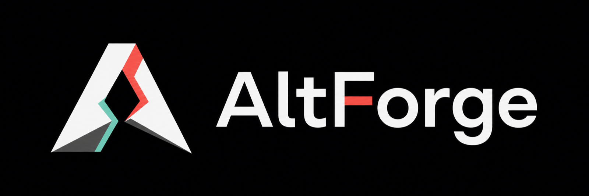

  

# Change Index

单次新需求、bugfix、重构或流程变化先进入 `active/`，完成收敛后移动到 `completed/YYYY/MM/`，放弃或被替代时进入 `legacy/YYYY/MM/`。

## Active

| ID | 标题 | 状态 |
|---|---|---|
| [`CHG-20260809-002`](active/CHG-20260809-002-windows-altserver-monorepo/README.md) | 将 Windows AltServer 纳入单仓库交付 | In progress |
| [`CHG-20260809-007`](active/CHG-20260809-007-macos-server-identity-settings/README.md) | macOS Server 身份、菜单与设置 | In progress |
| [`CHG-20260810-002`](active/CHG-20260810-002-macos-menu-icon-scale/README.md) | 放大 macOS 菜单栏图标 | Implemented / menu bar smoke pending |
| [`CHG-20260810-001`](active/CHG-20260810-001-macos-inline-settings-menu/README.md) | macOS 菜单内联设置与安装图标修复 | In progress / live settings smoke |
| [`CHG-20260810-003`](active/CHG-20260810-003-macos-apple-id-account-manager/README.md) | macOS Apple ID 账号管理 | In progress |
| [`CHG-20260810-004`](active/CHG-20260810-004-resilient-macos-installation/README.md) | macOS 可见安装进度与可靠 Release 下载 | In progress |
| [`CHG-20260810-005`](active/CHG-20260810-005-ios-app-group-migration-fallback/README.md) | iOS App Group 迁移降级修复 | In progress |
| [`CHG-20260811-004`](active/CHG-20260811-004-ios-install-crash-diagnostics-authentication/README.md) | iOS 安装中断崩溃、恢复日志与认证说明 | In progress / device E2E pending |
| [`CHG-20260811-006`](active/CHG-20260811-006-ios-theme-color-selection/README.md) | iOS 主题色选择与默认品牌色 | Release build passed / visual matrix pending |
| [`CHG-20260814-001`](active/CHG-20260814-001-website-visual-repository-link/README.md) | 重构官网视觉并关联代码仓库 | In progress / hosted deploy secrets pending |
| [`CHG-20260904-001`](active/CHG-20260904-001-apple-authentication-response/README.md) | 修复 Apple 认证响应格式失败 | Build passed / account E2E pending |
| [`CHG-20260904-002`](active/CHG-20260904-002-user-facing-error-copy/README.md) | 统一错误码与用户提示 | Apple build/tests passed / Windows build pending |

## Completed

| ID | 标题 | 完成日期 |
|---|---|---|
| [`CHG-20260808-001`](completed/2026/08/CHG-20260808-001-spec-baseline/README.md) | 建立 Spec Init 文档基线 | 2026-08-08 |
| [`CHG-20260808-002`](completed/2026/08/CHG-20260808-002-unicode-ipa-compatibility/README.md) | Unicode IPA 安装兼容 | 2026-08-08 |
| [`CHG-20260808-003`](completed/2026/08/CHG-20260808-003-upstream-maintenance-fixes/README.md) | 上游维护修复筛选与移植 | 2026-08-08 |
| [`CHG-20260808-004`](completed/2026/08/CHG-20260808-004-project-governance/README.md) | 补齐项目工程治理与提交规则 | 2026-08-08 |
| [`CHG-20260809-001`](completed/2026/08/CHG-20260809-001-bilingual-readme/README.md) | 建立中英双语 README 与项目改动说明 | 2026-08-09 |
| [`CHG-20260809-005`](completed/2026/08/CHG-20260809-005-altforge-brand-assets/README.md) | 统一 AltForge 跨平台品牌资产 | 2026-08-09 |
| [`CHG-20260809-008`](completed/2026/08/CHG-20260809-008-brand-system-rollout/README.md) | 统一品牌系统全面替换 | 2026-08-09 |
| [`CHG-20260809-009`](completed/2026/08/CHG-20260809-009-repository-network-ownership/README.md) | 收敛仓库网络所有权 | 2026-08-09 |
| [`CHG-20260809-003`](completed/2026/08/CHG-20260809-003-tag-only-release-versioning/README.md) | 收敛 tag-only 构建与统一版本 | 2026-08-10 |
| [`CHG-20260809-004`](completed/2026/08/CHG-20260809-004-release-safety-update-independence/README.md) | 发布安全与更新独立性 | 2026-08-10 |
| [`CHG-20260809-006`](completed/2026/08/CHG-20260809-006-macos-dmg-local-validation/README.md) | macOS DMG 与本地安装验证 | 2026-08-10 |
| [`CHG-20260811-001`](completed/2026/08/CHG-20260811-001-ios-main-navigation/README.md) | 移除 iOS 聚合资讯页并收敛主导航 | 2026-08-11 |
| [`CHG-20260811-002`](completed/2026/08/CHG-20260811-002-ios-brand-settings-polish/README.md) | 收敛 iOS 品牌、配色与设置身份 | 2026-08-11 |
| [`CHG-20260811-003`](completed/2026/08/CHG-20260811-003-ios-public-identity-crash-name/README.md) | 修复 iOS 系统崩溃报告与公开品牌残留 | 2026-08-11 |
| [`CHG-20260811-005`](completed/2026/08/CHG-20260811-005-macos-dmg-finder-layout/README.md) | 收敛 macOS DMG Finder 布局 | 2026-08-11 |
| [`CHG-20260813-001`](completed/2026/08/CHG-20260813-001-static-download-website/README.md) | 建立 AltForge 静态下载官网 | 2026-08-13 |

## 记录要求

- change key 使用 `CHG-YYYYMMDD-NNN-short-name`。
- 至少记录背景、范围、需求/设计/测试/任务映射、实际验证、影响和残余风险。
- completed change 不承担当前事实；当前事实必须回写 workflow/knowledge/rules。
